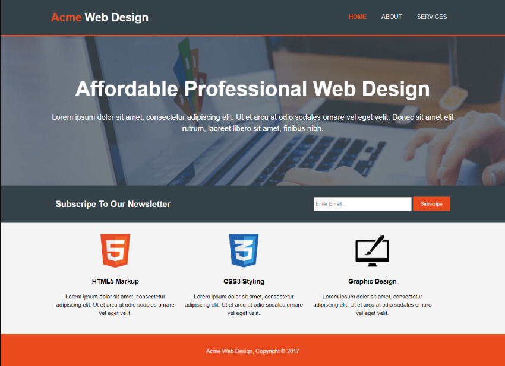

## Acme

suppose you want to start an IT company named Acme Web. You will offer HTML5 markup, CSS3 styling and Graphic Design as service. Now you need to make a website for your company.

Following image is the UI of your company website. All the content of the website is dynamic, that means contents will be loaded from database. Create correspondent database table for each information.

