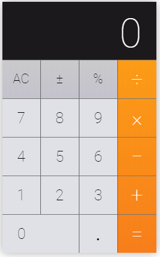

## Rifat's New Calculator

Remember, you made a calculator to your friend Rifat and He is ok with that. But now he need more facility with that calculator as well as that must look good.

One more important fact is Rifat don't want to use his server to do calculation. So you need to calculate numbers in frontend _(using javascript)_.

Now make a calculator that will look like the following image.

