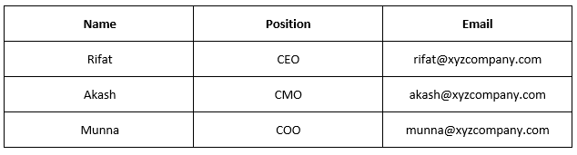
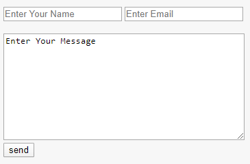

## Traversing through pages

XYZ Company needs a website that contains **3 pages**. They are **Home**, **About** & **Contact**.

1. Home page will contain their **logo** and **a big text of their motto**

2. About page will contain a **paragraph** about their company, a **list** of services they provide and a **table** containing team members info.

3. Contact page will contain a **form** with **name**, **email** & **message** fields.

N.B. Users should traverse other pages from each page.